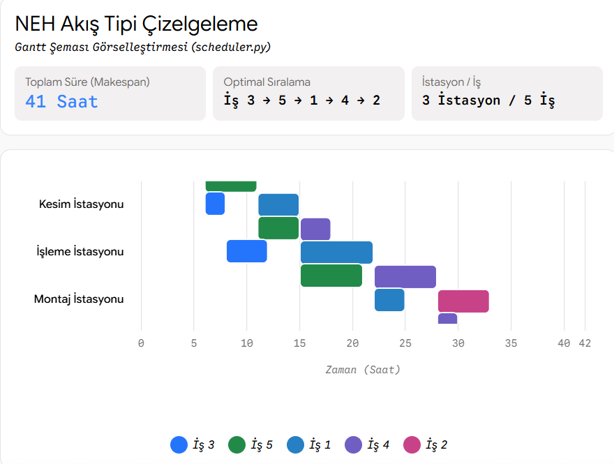

# 🏭 Permutation Flow Shop Scheduling (NEH Heuristic) with Gantt Visualization

An operations research project implementing the classic **Nawaz-Enscore-Ham (NEH)** heuristic algorithm to minimize total completion time (**Makespan / $C_{max}$**) in a multi-stage flow shop manufacturing environment.

## 📌 Problem Formulation
In a permutation flow shop, $n$ jobs must be processed on $m$ machines in the same technological order. Finding the optimal processing sequence is NP-hard. The NEH algorithm is widely regarded as one of the most effective constructive heuristics for this problem class.

## 🚀 Features
- **Constructive Heuristic:** Full implementation of the NEH algorithm in native Python.
- **Dynamic Makespan Evaluation:** Computes start, finish, and machine idle times.
- **Visual Schedule Generation:** Automatic export of high-resolution Gantt charts (`flow_shop_gantt.png`).
## 📊 Schedule Output

## 🛠️ Tech Stack
- Python 3.9+
- `matplotlib`, `pandas`, `numpy`
